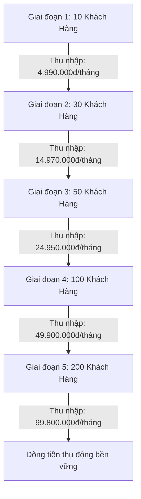

# 🚀 KẾ HOẠCH THƯƠNG MẠI HÓA & BIỂU PHÍ CHO THUÊ BOT ZALO AI
**Sản phẩm:** HAITECH BOT Studio — Trợ lý AI Chăm sóc & Chốt đơn khách hàng 1-1 trên Zalo  
**Tác giả:** Đội ngũ Kỹ thuật HAITECH  
**Cập nhật:** Phiên bản Thương mại 2026  

---

## 🎯 1. TỔNG QUAN CHIẾN LƯỢC KINH DOANH

### 1.1. Nỗi đau thị trường của các chủ Shop & Doanh nghiệp
* **Mất khách ngoài giờ hành chính:** Khách hàng thường nhắn tin sau 21h đêm hoặc giờ nghỉ trưa. Nếu không trả lời trong vòng 3 phút, 65% khách hàng sẽ chuyển sang mua của đối thủ.
* **Chi phí nhân sự trực chat cao:** Thuê 1 nhân viên trực chat ca tối/cuối tuần tốn từ **4.000.000đ – 6.500.000đ/tháng**, chưa kể tiền thưởng và rủi ro nhân viên nghỉ việc đột ngột.
* **Quá tải khi chạy quảng cáo:** Khi có chiến dịch khuyến mãi hoặc bài viết viral, hàng trăm khách đổ về Zalo cá nhân cùng lúc gây trôi tin nhắn và tư vấn thiếu sót.
* **Sợ lộ bí mật hoặc spam nhóm:** Các bot thông thường dễ bị lỗi trả lời vào các nhóm bạn bè/gia đình gây phản cảm. HAITECH BOT khắc phục triệt để bằng bộ lọc **chỉ trả lời 1-1 riêng tư khách cá nhân** và có nút **ngắt kết nối 1-click tức thì**.

### 1.2. Lựa chọn mô hình: Thuê bao định kỳ (SaaS - MRR) vs Mua trọn gói (One-Time)
| Tiêu chí | Bán trọn gói 1 lần | Cho thuê bao theo tháng (Khuyên dùng ⭐) |
| :--- | :--- | :--- |
| **Dòng tiền** | Thu 1 lần lớn rồi hết | **Dòng tiền định kỳ hàng tháng (MRR) tích lũy tăng dần** |
| **Rào cản gia nhập của khách** | Cao (khách phải chi 5 – 15 triệu đắn đo lâu) | **Cực thấp (chỉ từ 199k – 499k/tháng, quyết định ngay trong 5 phút)** |
| **Tỷ lệ giữ chân (Retention)** | Khó chăm sóc lại | **Khách đã nạp dữ liệu vào bot thì rất ít khi hủy (Chỉ số churn < 5%)** |
| **Giá trị vòng đời khách (LTV)** | Cố định 1 lần | **Khách thuê 1 - 2 năm mang lại 6.000.000đ - 12.000.000đ/shop** |

👉 **Chiến lược tối ưu nhất:** Lấy **Mô hình Thuê tháng (499k/tháng)** làm mũi nhọn tiếp cận đại trà hàng trăm shop, đồng thời giữ **Mô hình Setup trọn gói (9.5tr - 15tr)** cho các doanh nghiệp lớn muốn bàn giao máy chủ riêng.

---

## 💰 2. BIỂU PHÍ DỊCH VỤ & CƠ CẤU GÓI CƯỚC THƯƠNG MẠI

### 2.1. Bảng giá cho thuê định kỳ (Mô hình SaaS Subscription)

| Tên Gói | Giá Thuê Tháng | Giá Thuê Năm (Tiết kiệm 20%) | Đối Tượng Mục Tiêu | Tính Năng Nổi Bật |
| :--- | :---: | :---: | :--- | :--- |
| **GÓI KHỞI NGHIỆP** *(Starter)* | **199.000đ** / tháng | **1.990.000đ** / năm | Shop mới mở, kinh doanh cá nhân nhỏ (< 30 đơn/tháng) | • 1 Tài khoản Zalo cá nhân • Phản hồi riêng tư 1-1 (không vào group) • Nút ngắt khẩn cấp 1-click trên Dashboard • Não AI Google Gemini 2.5 Flash • Tối đa 20 tài liệu sản phẩm & FAQ |
| **GÓI PRO SHOP** *(Best Choice ⭐)* | **499.000đ** / tháng | **4.990.000đ** / năm *(Tặng 2 tháng)* | Cửa hàng online, spa, thời trang có 50 - 300 khách/ngày | • **Tất cả tính năng gói Khởi Nghiệp** • **Bộ Não Kép Dual Brain (Groq + Gemini)** phản hồi 0.3s • **Không giới hạn tài liệu & câu hỏi FAQ** • Tự động đọc dữ liệu từ Website/Catalog • Kịch bản chốt đơn và điều hướng bán hàng • Quản lý Leads CRM khách hàng tiềm năng • Hỗ trợ cài đặt Ultraview từ xa |
| **GÓI DOANH NGHIỆP** *(Enterprise)* | **990.000đ** / tháng | **9.900.000đ** / năm | Chuỗi bán lẻ, bất động sản, thẩm mỹ viện lớn | • **Tất cả tính năng gói Pro Shop** • Xây dựng kịch bản phễu chốt đơn chuyên sâu • Nạp & cập nhật tồn kho sản phẩm định kỳ hàng tuần • Cam kết tốc độ phản hồi < 2s (SLA 99.9%) • Hotline kỹ sư hỗ trợ riêng 24/7 • Báo cáo tỷ lệ chuyển đổi hàng tuần |
| **GÓI WHITELABEL AGENCY** *(Đại lý)* | **2.990.000đ** / tháng | **29.900.000đ** / năm | Cá nhân/Marketer muốn tự kinh doanh thương hiệu riêng | • Quản lý tối đa **10 shop khách hàng** • Đổi tên thương hiệu, Logo, Domain của đại lý • Tự thu tiền khách và **giữ 100% lợi nhuận** • Hỗ trợ kỹ thuật cấp cao từ HAITECH |

---

### 2.2. Bảng giá chuyển giao & Setup trọn gói vĩnh viễn (One-Time)

Dành riêng cho khách hàng doanh nghiệp không muốn trả phí thuê tháng mà muốn mua trọn gói phần mềm:

1. **Gói Setup Trải Nghiệm:** `2.999.000đ` (Cài đặt trên PC shop, nạp 20 tài liệu, bảo hành 30 ngày).
2. **Gói Setup Cửa Hàng Pro (Khuyên dùng):** `9.500.000đ` (Cài đặt Cloud VPS 24/7, nạp 100 tài liệu, 50 kịch bản, đào tạo 3 nhân viên, bảo hành 90 ngày).
3. **Gói Setup Siêu Trí Tuệ Enterprise:** `15.000.000đ` (Tùy biến nghiệp vụ, tích hợp CRM ngoài, tặng 1 năm Cloud VPS, đào tạo 5 nhân viên, bảo hành 180 ngày).

---

## 🔬 3. BÓC TÁCH CHI PHÍ VẬN HÀNH & BIÊN LỢI NHUẬN RÒNG

### 3.1. Chi phí API Trí Tuệ Nhân Tạo (Não AI)
* **Google Gemini 2.5 Flash Free Tier:** Google cung cấp miễn phí **1.500 requests / ngày** (~45.000 lượt chat / tháng) cho mỗi tài khoản Google AI Studio.
  * Một shop online trung bình có từ 50 - 150 tin nhắn/ngày.
  * Nghĩa là **1 tài khoản Google Gemini miễn phí có thể nuôi từ 8 - 10 shop khách hàng cùng lúc** mà chi phí AI là **0 VNĐ**.
* **GroqCloud LPU (Siêu tốc 0.3s):** Miễn phí hoàn toàn với giới hạn 30 requests/phút cho model Llama-3.3-70b-versatile -> Chi phí: **0 VNĐ**.
* **DeepSeek / OpenRouter (nếu khách dùng lưu lượng khổng lồ):** Chi phí chỉ $0.14 / 1.000.000 token (~3.500đ cho 1.000 câu trả lời) -> Trung bình mỗi shop chỉ tốn tối đa **10.000đ – 15.000đ/tháng**.

### 3.2. Chi phí Hạ tầng & Máy chủ (Server / Hosting)
* **Trường hợp 1 (Khách chạy trên máy tính cá nhân qua file `.bat`):** Chi phí server = **0 VNĐ**.
* **Trường hợp 2 (Triển khai VPS Cloud tập trung cho 50 shop):**
  * Thuê 1 VPS Linux (2 Core CPU, 4GB RAM, SSD 50GB) tại Vietnix / TinoHost / DigitalOcean giá khoảng: **150.000đ / tháng**.
  * Chạy Node.js quản lý 50 tiến trình bot siêu nhẹ (mỗi tiến trình chỉ tốn ~50MB RAM).
  * Chi phí tính trên mỗi shop: `150.000đ / 50 shop = 3.000đ / shop / tháng`.

### 3.3. Bảng phân tích Biên Lợi Nhuận Ròng (Net Margin) trên 1 khách thuê gói Pro Shop (499k/tháng)

| Hạng mục chi phí | Số tiền / tháng | Ghi chú |
| :--- | :---: | :--- |
| **Doanh thu gói Pro Shop** | **+ 499.000đ** | Thu từ khách hàng đầu tháng |
| Chi phí API Trí tuệ nhân tạo (Gemini Free) | - 0đ | Tận dụng hạn mức 1.500 req/ngày |
| Chi phí điện toán đám mây VPS Cloud | - 3.000đ | Phân bổ trên cụm 50 shop |
| Chi phí tin nhắn Zalo hỗ trợ khách | - 2.000đ | Chăm sóc khách hàng |
| Dự phòng phát sinh khác | - 10.000đ | Chi phí bảo trì |
| **TỔNG LỢI NHUẬN RÒNG (NET PROFIT)** | **+ 484.000đ / shop** | **Biên lợi nhuận ròng đạt: 97.0%** 🚀 |

---

## 📈 4. LỘ TRÌNH MỤC TIÊU DOANH THU & LỢI NHUẬN THỰC TẾ

Khi bạn áp dụng mô hình cho thuê định kỳ 499.000đ/tháng:

| Cột mốc khách hàng | Doanh thu định kỳ (MRR) | Chi phí vận hành ước tính | Lợi nhuận ròng hàng tháng |
| :---: | :---: | :---: | :---: |
| **10 Shop** | 4.990.000đ / tháng | 0đ (Chạy local) | **~4.990.000đ / tháng** |
| **30 Shop** | 14.970.000đ / tháng | 150.000đ (1 VPS) | **~14.820.000đ / tháng** |
| **50 Shop** | 24.950.000đ / tháng | 150.000đ (1 VPS) | **~24.800.000đ / tháng** |
| **100 Shop** | 49.900.000đ / tháng | 350.000đ (VPS Pro) | **~49.550.000đ / tháng** |
| **200 Shop** | 99.800.000đ / tháng | 700.000đ (Cluster VPS) | **~99.100.000đ / tháng** |

> 💡 **Nhận định:** Chỉ cần đạt mốc **50 chủ shop** tại địa phương hoặc các hội nhóm bán hàng online, bạn đã tạo ra nguồn thu nhập thụ động **~25 triệu đồng mỗi tháng** với thời gian bảo trì chưa tới 1 tiếng/tuần.

---

## 🎯 5. PHỄU BÁN HÀNG & KỊCH BẢN CHỐT ĐƠN 5 BƯỚC

### Bước 1: Mở Phễu — Tặng 7 Ngày Dùng Thử Miễn Phí 100%
* **Thông điệp:** *"Trải nghiệm trợ lý AI trực chat Zalo cá nhân 24/7 — Miễn phí 7 ngày không cần thẻ ngân hàng."*
* Hướng khách hàng vào form `#dung-thu` trên website hoặc gửi link `index.html#dung-thu`.
* Dữ liệu khách hàng đăng ký (Tên, SĐT Zalo, Ngành hàng) lập tức nhảy vào bảng **Leads CRM** trên màn hình `dashboard.html`.

### Bước 2: Thiết Lập Trong 3 Phút (Onboarding Siêu Tốc)
* Nhắn Zalo cho khách: *"Dạ em chào anh/chị [Tên], em bên đội ngũ HAITECH BOT. Em thấy anh/chị vừa đăng ký trải nghiệm bot trực Zalo cho shop [Tên Shop]. Em xin phép hỗ trợ anh/chị nạp bảng giá và quét mã kết nối trong 3 phút để bot bắt đầu trực ngay chiều nay nhé ạ!"*
* Gửi file nạp dữ liệu mẫu hoặc xin link Fanpage/Website của khách để nạp sẵn vào bot.
* Hướng dẫn khách quét QR bằng file `CHAY_BOT_ZALO.bat` hoặc bật trên Dashboard.

### Bước 3: Chứng Minh Giá Trị Trong 7 Ngày
* Bot tự động trả lời khách ban đêm, sáng hôm sau chủ shop mở máy lên thấy đơn hàng đã được bot tư vấn giá, tồn kho và chốt địa chỉ nhận hàng.
* Chủ shop thấy rõ bot **không hề can thiệp vào các nhóm chat Zalo**, bảo mật riêng tư tuyệt đối và có thể ngắt bất cứ lúc nào bằng nút đỏ trên Dashboard.

### Bước 4: Chốt Đơn Vào Ngày Thứ 5 (Closing Day)
* Nhắn tin báo cáo hiệu quả:  
  *"Anh/chị [Tên] ơi, trong 5 ngày qua bot đã tự động hỗ trợ [Số lượng] lượt khách nhắn tin ngoài giờ giúp shop mình. Ngày kia gói trải nghiệm 7 ngày sẽ hết hạn.  
  Hiện tại bên em đang có ưu đãi cho khách dùng thử: **Gói Pro Shop chỉ 499k/tháng** (hoặc thanh toán 1 năm tặng thêm 2 tháng là 4.990k). Em gia hạn tiếp cho shop mình luôn để bot không bị gián đoạn nhé ạ?"*

### Bước 5: Giữ Chân Khách & Upsell
* Khách hàng đã quen với việc bot tự trả lời ngoài giờ sẽ **rất sợ quay lại cảnh nửa đêm phải thức dậy gõ tin nhắn**. Tỷ lệ đồng ý gia hạn tiếp gói 499k đạt **từ 60% – 75%**.

---

## 💬 6. BỘ KỊCH BẢN XỬ LÝ TỪ CHỐI (OBJECTION HANDLING)

#### ❓ Khách hỏi: "Bot trả lời có bị ngô nghê như mấy con chatbot ngân hàng không?"
> **Trả lời:** *"Dạ không anh/chị ạ! Chatbot ngân hàng ngày xưa là bot bấm phím theo cây thư mục cứng nhắc (bấm phím 1, phím 2). Còn HAITECH BOT chạy bằng **Trí Tuệ Nhân Tạo AI thế hệ mới (Google Gemini / Groq)**. Bot đọc hiểu ngôn ngữ tự nhiên tiếng Việt, hiểu được tiếng lóng, viết tắt, và chỉ trả lời đúng dựa trên tài liệu giá cả, chính sách của chính shop mình. Em cài bản dùng thử cho anh/chị nhắn thử vài câu kiểm tra trước là ưng ý ngay ạ!"*

#### ❓ Khách hỏi: "499k/tháng có đắt quá không em?"
> **Trả lời:** *"Dạ tính ra mỗi ngày shop chỉ bỏ ra **16.000đ** — chưa bằng nửa ly cà phê sáng anh/chị ạ! Nhưng đổi lại shop có một 'nhân viên kỳ lân' trực Zalo 24/24, không bao giờ ngủ quên, không bao giờ đi trễ, khách hỏi lúc 1 giờ sáng cũng báo giá và giữ chân khách ngay. Chỉ cần bot chốt giúp shop thêm 1 - 2 đơn hàng ngoài giờ là đã dư tiền thuê bot cả tháng rồi ạ."*

#### ❓ Khách hỏi: "Lỡ bot nói bậy hay nhắn lung tung vào nhóm bạn bè thì sao?"
> **Trả lời:** *"Dạ anh/chị hoàn toàn yên tâm! Phần mềm được lập trình bộ lọc đặc biệt: **Chỉ trả lời riêng tư 1-1 với khách cá nhân, tuyệt đối không bao giờ trả lời vào bất kỳ nhóm chat hay hội bạn bè nào**. Ngoài ra, ngay trên màn hình Dashboard luôn có nút **🛑 Ngắt Bot tức thì 1-click**, khi nào anh/chị thích tự chat thì bấm ngắt, khi nào bận thì bấm bật lại chỉ trong 1 giây ạ."*

---

## 📜 7. HỢP ĐỒNG CUNG CẤP DỊCH VỤ MẪU (CHUẨN PHÁP LÝ)

Xem chi tiết văn bản hợp đồng kinh tế và chứng nhận bản quyền thương mại tại file:  
👉 [CHUNG_NHAN_BAN_QUYEN_VA_HOP_DONG_MAU.md](file:///e:/BOT%20ZALO%20CH%C4%82M%20S%C3%93C%20KH%C3%81CH%20%20T%E1%BB%B0%20%C4%90%E1%BB%98NG/CHUNG_NHAN_BAN_QUYEN_VA_HOP_DONG_MAU.md)

---

## 🛠️ 8. DANH MỤC CÁC CÔNG CỤ ĐÃ HOÀN THIỆN ĐỂ BẠN BẮT ĐẦU BÁN NGAY

1. **Giao diện Giới thiệu & Bảng giá công khai:** [index.html](file:///e:/BOT%20ZALO%20CH%C4%82M%20S%C3%93C%20KH%C3%81CH%20%20T%E1%BB%B0%20%C4%90%E1%BB%98NG/index.html)  
   * Có form Đăng ký dùng thử 7 ngày (`#dung-thu`).  
   * Có nút chuyển đổi Bảng giá thuê theo tháng vs Trọn gói.  
2. **Màn hình Quản trị chuyên nghiệp:** [dashboard.html](file:///e:/BOT%20ZALO%20CH%C4%82M%20S%C3%93C%20KH%C3%81CH%20%20T%E1%BB%B0%20%C4%90%E1%BB%98NG/dashboard.html)  
   * Nút **🛑 Ngắt Bot Zalo tức thì** hiển thị nổi bật trên đầu trang.  
   * Tab **🎁 Đăng ký trải nghiệm** & Bảng quản lý khách hàng tiềm năng (**Leads CRM**).  
   * Tab **💰 Bảng giá & Cho thuê** kèm công cụ kéo thanh trượt tính toán Doanh thu & Lợi nhuận ròng.  
3. **Bộ mã nguồn Bot lõi chuẩn an toàn:** [bot-zalo-personal.js](file:///e:/BOT%20ZALO%20CH%C4%82M%20S%C3%93C%20KH%C3%81CH%20%20T%E1%BB%B0%20%C4%90%E1%BB%98NG/bot-zalo-personal.js)  
   * Lọc chỉ chat 1-1, chống spam nhóm, hỗ trợ lệnh tắt khẩn cấp từ xa qua Zalo (`#tatbot`).  
4. **Phím tắt ngắt kết nối vật lý tức thì:** [NGAT_KET_NOI_BOT.bat](file:///e:/BOT%20ZALO%20CH%C4%82M%20S%C3%93C%20KH%C3%81CH%20%20T%E1%BB%B0%20%C4%90%E1%BB%98NG/NGAT_KET_NOI_BOT.bat)  
   * 1-click đóng ngay toàn bộ tiến trình bot và xóa phiên đăng nhập khi cần bảo mật.
