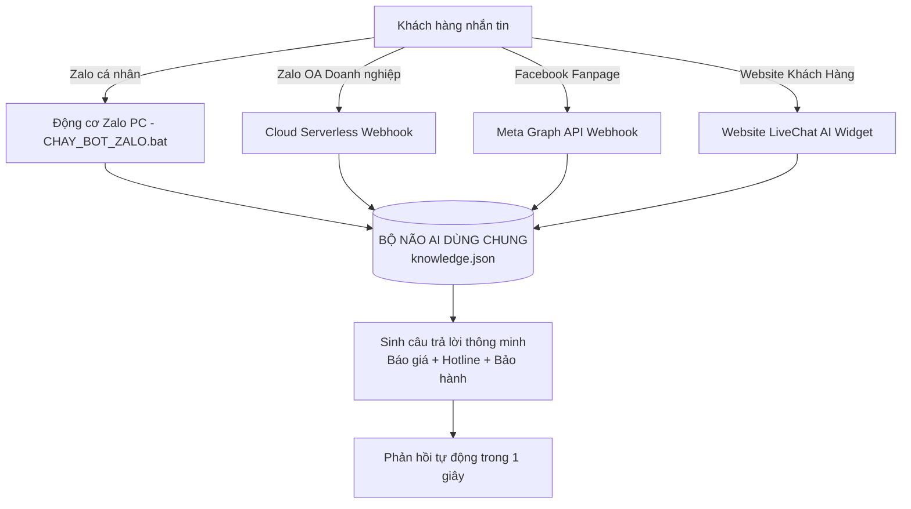

# 📖 CẨM NANG HƯỚNG DẪN CÀI ĐẶT & VẬN HÀNH HAITECH BOT STUDIO
### *Hệ Thống Trợ Lý AI Chăm Sóc Khách Hàng Tự Động 24/7 Đa Kênh & Bộ Não Kép OpenAI GPT*

> **Đơn vị phát triển:** HAITECH BOT STUDIO  
> **Hotline/Zalo hỗ trợ kỹ thuật 24/7:** 0988 739 896  
> **Email:** vanhaitech.86@gmail.com  
> **Hệ thống Cloud Webhook:** https://bot-zalo-ai.vercel.app  
> **Phiên bản:** v1.0.0 Thương Mại  

---

## 📑 MỤC LỤC
1. [Chương 1: Giới thiệu hệ thống HAITECH BOT](#chương-1-giới-thiệu-hệ-thống-haitech-bot)
2. [Chương 2: Yêu cầu hệ thống & Cài đặt lần đầu](#chương-2-yêu-cầu-hệ-thống--cài-đặt-lần-đầu)
3. [Chương 3: Hướng dẫn kích hoạt & Sử dụng Zalo Cá Nhân](#chương-3-hướng-dẫn-kích-hoạt--sử-dụng-zalo-cá-nhân)
4. [Chương 4: Hướng dẫn nạp bảng giá & Tri thức vào Bộ Não AI](#chương-4-hướng-dẫn-nạp-bảng-giá--tri-thức-vào-bộ-não-ai)
5. [Chương 5: Hướng dẫn kết nối Facebook Fanpage Messenger (Cloud 24/7)](#chương-5-hướng-dẫn-kết-nối-facebook-fanpage-messenger-cloud-247)
6. [Chương 6: Hướng dẫn kết nối Zalo Official Account (Zalo Doanh Nghiệp)](#chương-6-hướng-dẫn-kết-nối-zalo-official-account-zalo-doanh-nghiệp)
7. [Chương 7: Hướng dẫn kết nối Website (Widget LiveChat AI 1-Dòng Mã)](#chương-7-hướng-dẫn-kết-nối-website-widget-livechat-ai-1-dòng-mã)
8. [Chương 8: Hướng dẫn kích hoạt Bộ Não Thứ 2 (Model OpenAI GPT)](#chương-8-hướng-dẫn-kích-hoạt-bộ-não-thứ-2-model-openai-gpt)
9. [Chương 9: Bảng mã lỗi & Hướng dẫn xử lý sự cố (Troubleshooting)](#chương-9-bảng-mã-lỗi--hướng-dẫn-xử-lý-sự-cố-troubleshooting)

---

## CHƯƠNG 1: GIỚI THIỆU HỆ THỐNG HAITECH BOT

**HAITECH BOT STUDIO** là giải pháp phần mềm trí tuệ nhân tạo (AI) giúp cá nhân kinh doanh, chủ shop online và doanh nghiệp tự động hóa 100% khâu tư vấn, báo giá, chốt đơn và chăm sóc khách hàng trên 4 kênh liên lạc phổ biến nhất tại Việt Nam:



### Điểm mạnh độc quyền:
- **Đồng bộ 1 nguồn tri thức:** Bạn chỉ cần sửa giá hoặc sản phẩm tại 1 file duy nhất (`knowledge.json`), cả Zalo cá nhân, Zalo OA và Facebook Fanpage đều cập nhật ngay tức thì.
- **Tốc độ phản hồi < 1 giây:** Giữ chân khách hàng ngay khi họ phát sinh nhu cầu mua sắm.
- **Tiết kiệm chi phí:** Thay thế 2 - 3 nhân viên trực chat ca tối và ngày lễ.

---

## CHƯƠNG 2: YÊU CẦU HỆ THỐNG & CÀI ĐẶT LẦN ĐẦU

### 1. Yêu cầu thiết bị:
- **Hệ điều hành:** Windows 10, Windows 11 (hoặc Windows Server).
- **RAM:** Tối thiểu 2GB (Khuyên dùng 4GB trở lên).
- **Kết nối mạng:** Đường truyền Internet ổn định.
- **Môi trường chạy:** [Node.js](https://nodejs.org/) (phiên bản LTS 18, 20 hoặc 22 trở lên).

### 2. Cài đặt tự động chỉ với 1-Click:
1. Giải nén thư mục phần mềm được bàn giao.
2. Tìm và nhấp đúp vào file:
   👉 **`CAI_DAT_LAN_DAU.bat`**
3. Cửa sổ màu xanh sẽ tự động:
   - Kiểm tra Node.js (nếu máy chưa có, trình duyệt sẽ tự mở trang tải Node.js về cài đặt miễn phí).
   - Tự động tải và cài đặt các thư viện kết nối Zalo và giải mã QR.
   - Khi màn hình hiện `CHÚC MỪNG! CÀI ĐẶT HAITECH BOT THÀNH CÔNG 100%!` là bạn đã sẵn sàng!

---

## CHƯƠNG 3: HƯỚNG DẪN KÍCH HOẠT & SỬ DỤNG ZALO CÁ NHÂN

Chức năng này biến tài khoản Zalo cá nhân trên điện thoại của bạn thành một nhân viên AI trực chat 24/7 ngay trên máy tính:

### 🔹 Bước 1: Khởi động Bot
Nhấp đúp chuột vào file:
👉 **`CHAY_BOT_ZALO.bat`**

### 🔹 Bước 2: Quét mã QR xác nhận kết nối
- Đợi 3 - 5 giây, mã QR sẽ hiển thị **trực tiếp trong cửa sổ màu đen** và **tự động bật 1 tab trên trình duyệt web (`qr.html`)** với mã QR to rõ.
- Mở ứng dụng **Zalo** trên điện thoại ➡️ Nhấn vào biểu tượng **Quét mã QR** (ở góc trên cùng bên phải).
- Quét camera vào mã QR trên màn hình ➡️ Nhấn **Đăng nhập** (hoặc *Xác nhận*) trên điện thoại.
- Khi màn hình hiện:
  ```text
  🎉 HAITECH BOT ĐÃ SẴN SÀNG HOẠT ĐỘNG 100%!
  🟢 BOT ĐANG CHẠY NỀN TRỰC CHAT TRÊN ZALO CỦA BẠN!
  ```
  ➡️ Bot đã chính thức hoạt động!

### 🔹 Bước 3: Tự động lưu phiên cho lần sau
Hệ thống sẽ tự lưu phiên đăng nhập vào file `session.json`. Từ lần sau, mỗi khi bạn bật `CHAY_BOT_ZALO.bat`, bot sẽ **tự đăng nhập luôn mà không cần quét lại mã QR** nữa!

### 🔹 Bước 4: Cách ngắt kết nối và dừng Bot khi cần
Khi bạn muốn tắt bot, có 3 cách:
- **Cách nhanh nhất:** Nhấp đúp vào file **`NGAT_KET_NOI_BOT.bat`** (tự động tắt tiến trình và xóa phiên).
- **Cách thủ công:** Bấm tổ hợp phím **`Ctrl + C`** hoặc bấm dấu **X** tắt cửa sổ đen.
- **Cách từ xa trên điện thoại:** Mở Zalo điện thoại ➡️ Cài đặt (⚙️) ➡️ *Tài khoản và bảo mật* ➡️ *Lịch sử đăng nhập* ➡️ Chọn phiên máy tính vừa kết nối ➡️ Bấm **Đăng xuất**.

---

## CHƯƠNG 4: HƯỚNG DẪN NẠP BẢNG GIÁ & TRI THỨC VÀO BỘ NÃO AI

Toàn bộ thông tin sản phẩm, báo giá, khuyến mãi và thông tin liên hệ được quản lý tập trung tại file:
👉 **`knowledge.json`**

Bạn có thể mở file này bằng phần mềm **Notepad**, **Notepad++** hoặc **VS Code**.

### Cấu trúc mẫu chuẩn:
```json
{
  "botName": "Em Lan - Trợ lý HAITECH BOT",
  "phone": "0988 739 896",
  "email": "vanhaitech.86@gmail.com",
  "welcomeMessage": "Dạ em chào anh/chị ạ! Em là Trợ lý AI của HAITECH BOT...",
  "rules": [
    {
      "keywords": ["giá", "báo giá", "chi phí", "bao nhiêu tiền"],
      "reply": "Dạ bên em có bảng giá ưu đãi tốt nhất hôm nay. Anh/chị cho em xin số điện thoại hoặc gọi hotline: 0988 739 896 để nhận báo giá chi tiết nhé ạ! 📋"
    },
    {
      "keywords": ["bảo hành", "sửa", "hỏng"],
      "reply": "Dạ tất cả sản phẩm đều được bảo hành chính hãng tận nơi 12 tháng ạ!"
    }
  ]
}
```

### Cách thêm sản phẩm mới:
Muốn thêm sản phẩm mới (Ví dụ: *Máy RO150*), bạn chỉ cần thêm một khối quy tắc vào mục `rules`:
```json
{
  "keywords": ["ro150", "máy 150", "lọc 150l"],
  "reply": "Dạ máy lọc nước RO150 hiện có giá 91.800.000đ đã gồm trọn gói lắp đặt và bảo hành 12 tháng tận nơi ạ! Hotline hỗ trợ: 0988 739 896"
}
```
> [!TIP]
> **Tính năng Hot-Reload:** Khi bạn sửa và lưu file `knowledge.json`, Bot đang chạy sẽ **tự động nạp dữ liệu mới ngay lập tức** mà không cần tắt đi bật lại!

---

## CHƯƠNG 5: HƯỚNG DẪN KẾT NỐI FACEBOOK FANPAGE MESSENGER (CLOUD 24/7)

Chức năng này giúp Bot tự động trả lời tin nhắn trên Fanpage Facebook mà **không cần bật máy tính**:

### 🔹 Bước 1: Lấy thông tin Webhook từ Dashboard
Mở file [**`dashboard.html`**](file:///e:/BOT%20ZALO%20CH%C4%82M%20S%C3%93C%20KH%C3%81CH%20%20T%E1%BB%B0%20%C4%90%E1%BB%98NG/dashboard.html) ➡️ Chọn Tab **`🌐 Kết nối Facebook Fanpage`**:
- **Callback URL:** `https://bot-zalo-ai.vercel.app/api/facebook-webhook`
- **Verify Token:** `haitech_fanpage_bot_secret`

### 🔹 Bước 2: Thiết lập trên Meta for Developers
1. Truy cập: [https://developers.facebook.com/](https://developers.facebook.com/) ➡️ Đăng nhập tài khoản Facebook quản trị Fanpage.
2. Chọn **Ứng dụng của tôi** ➡️ **Tạo ứng dụng** ➡️ Chọn loại *Doanh nghiệp* hoặc *Khác*.
3. Thêm sản phẩm **Messenger** vào ứng dụng.
4. Tìm đến mục **Webhooks**:
   - Dán **Callback URL** và **Verify Token** ở trên vào.
   - Bấm **Xác minh và lưu**.
   - Tích chọn đăng ký sự kiện: `messages` và `messaging_postbacks`.

### 🔹 Bước 3: Tạo Page Access Token & Bật Bot
1. Ở mục **Mã truy cập trang**, chọn Fanpage của bạn và bấm **Tạo mã truy cập**.
2. Copy mã Token dán vào ô *Mã truy cập trang* trong [**`dashboard.html`**](file:///e:/BOT%20ZALO%20CH%C4%82M%20S%C3%93C%20KH%C3%81CH%20%20T%E1%BB%B0%20%C4%90%E1%BB%98NG/dashboard.html).
3. Bấm **Lưu cấu hình Fanpage** ➡️ Bấm **Kiểm tra kết nối Fanpage**.
4. Khi hệ thống báo *Kết nối thành công tới Fanpage: [Tên trang của bạn]*, quá trình kết nối đã hoàn tất 100%!

---

## CHƯƠNG 6: HƯỚNG DẪN KẾT NỐI ZALO OFFICIAL ACCOUNT (ZALO DOANH NGHIỆP)

Dành cho các doanh nghiệp, công ty có tài khoản Zalo OA có tích vàng hoặc tích xác thực:

1. Đăng ký trang Zalo OA tại: [https://oa.zalo.me/](https://oa.zalo.me/).
2. Truy cập cổng lập trình viên: [https://developers.zalo.me/](https://developers.zalo.me/) ➡️ Vào Ứng dụng của bạn.
3. Chọn mục **Webhook**:
   - Dán URL Webhook: `https://bot-zalo-ai.vercel.app/api/zalo-webhook`
   - Bật sự kiện `user_send_text` (Người dùng gửi tin nhắn văn bản).
   - Bấm **Lưu**.
4. Kể từ lúc này, mọi tin nhắn gửi đến Zalo OA đều được Bot xử lý và phản hồi tự động theo đúng bảng giá bạn đã cài đặt!

---

## CHƯƠNG 7: HƯỚNG DẪN KẾT NỐI WEBSITE (WIDGET LIVECHAT AI 1-DÒNG MÃ)

Tính năng **LiveChat AI Widget** cho phép bạn hoặc khách hàng nhúng một trợ lý AI bán hàng và chăm sóc khách hàng thông minh lên bất kỳ trang web nào chỉ với **1 dòng mã duy nhất**.

```html
<!-- Mã nhúng nhanh mặc định -->
<script src="https://bot-zalo-ai.vercel.app/haitech-chat-widget.js" async></script>
```

### 🌟 Các tính năng nổi bật của Widget Website:
- **Tự động thích ứng (Responsive):** Hiển thị hoàn hảo trên cả máy tính, máy tính bảng và điện thoại di động.
- **Nút liên hệ đa kênh (Omnichannel Bar):** Khách có thể vừa trò chuyện trực tiếp với AI trên web, vừa bấm 1-chạm để gọi **Hotline**, mở **Zalo cá nhân** (`https://zalo.me/0988739896`) hoặc mở **Messenger**.
- **Gợi ý câu hỏi nhanh (Quick Chips):** Giúp khách hàng bấm hỏi giá, khuyến mãi, bảo hành mà không cần gõ phím.
- **Dùng chung Bộ Não AI:** Trả lời theo đúng dữ liệu giá và chính sách được thiết lập trên Dashboard / file `knowledge.json`.

---

### 🔹 Cách 1: Tùy biến Widget theo màu sắc thương hiệu
Bạn có thể mở [**`dashboard.html`**](file:///e:/BOT%20ZALO%20CH%C4%82M%20S%C3%93C%20KH%C3%81CH%20%20T%E1%BB%B0%20%C4%90%E1%BB%98NG/dashboard.html) ➡️ Chọn Tab **`💻 Kết nối Website (Widget AI)`** để tự chỉnh:
- Màu sắc chủ đạo (Xanh dương, Xanh lá, Cam đỏ, Tím hoặc mã màu HEX riêng).
- Vị trí hiển thị: Góc phải màn hình hoặc Góc trái màn hình.
- Tên trợ lý AI & Lời chào mở đầu.
- Số điện thoại Hotline.

Mã nhúng tùy biến mẫu:
```html
<script src="https://bot-zalo-ai.vercel.app/haitech-chat-widget.js" 
  data-color="#0077B6" 
  data-position="right" 
  data-bot-name="Em Lan - Trợ lý HAITECH BOT" 
  data-phone="0988 739 896" 
  data-greeting="Dạ em chào anh/chị ạ! Em là Trợ lý AI của HAITECH BOT. Anh/chị cần em tư vấn sản phẩm hay gửi bảng giá ưu đãi hôm nay ạ? 😊" 
  async></script>
```

---

### 🔹 Cách 2: Hướng dẫn dán mã vào các nền tảng Website phổ biến:

#### 1. Nền tảng WordPress / WooCommerce:
1. Đăng nhập trang quản trị WordPress (`/wp-admin`).
2. Vào **Giao diện (Appearance)** ➡️ **Chỉnh sửa Tệp Giao diện (Theme File Editor)**.
3. Ở cột bên phải, bấm mở file **`footer.php`** (Chân trang giao diện).
4. Cuộn xuống cuối file, dán đoạn mã `<script...>` vào **ngay trước thẻ `</body>`**.
5. Bấm **Cập nhật tệp (Update File)** là xong!

#### 2. Nền tảng Haravan / Sapo / Shopify:
1. Vào mục **Website** ➡️ **Giao diện (Themes)** ➡️ **Chỉnh sửa Code (Edit HTML/CSS)**.
2. Tìm file **`theme.liquid`** (hoặc `theme.master`).
3. Dán đoạn mã `<script...>` vào ngay trước thẻ đóng `</body>`.
4. Bấm **Lưu**.

#### 3. Nền tảng LadiPage / Trang đích HTML:
1. Mở trang Landing Page cần cài đặt trong trình thiết kế LadiPage.
2. Bấm vào menu **Thiết lập trang** ➡️ Chọn mục **Mã JavaScript / CSS**.
3. Chọn thẻ **Body**.
4. Dán đoạn mã `<script...>` vào và bấm **Đóng** ➡️ Bấm **Xuất bản lại trang**.

---

## CHƯƠNG 8: HƯỚNG DẪN KÍCH HOẠT BỘ NÃO THỨ 2 (MODEL OPENAI GPT)

**Kiến trúc Trí Tuệ Kép (Dual-Brain Hybrid AI)** là tính năng cao cấp nhất của **HAITECH BOT STUDIO**, kết hợp hoàn hảo giữa 2 bộ não:
1. **Bộ Não 1 (Tri thức & Bảng giá chuẩn):** Trả lời tức thì (< 0.1s), chi phí 0đ, độ chuẩn xác 100% về giá bán, thông số và hotline chính thức.
2. **Bộ Não 2 (AI Ngôn Ngữ Lớn OpenAI GPT):** Tự động kích hoạt khi khách hỏi câu hỏi mở, so sánh công nghệ, đàm phán, tư vấn giải pháp hoặc trò chuyện tự nhiên ngoài kịch bản có sẵn.

---

### 🔹 Bước 1: Lấy API Key từ OpenAI
1. Truy cập trang quản trị lập trình viên của OpenAI: [https://platform.openai.com/](https://platform.openai.com/).
2. Đăng ký hoặc đăng nhập tài khoản OpenAI.
3. Vào mục **API Keys** ➡️ Bấm **Create new secret key** ➡️ Đặt tên (Ví dụ: `HaitechBotKey`).
4. Sao chép chuỗi khóa bí mật (dạng `sk-proj-...`).

---

### 🔹 Bước 2: Cấu hình trên Dashboard
Mở file [**`dashboard.html`**](file:///e:/BOT%20ZALO%20CH%C4%82M%20S%C3%93C%20KH%C3%81CH%20%20T%E1%BB%B0%20%C4%90%E1%BB%98NG/dashboard.html) ➡️ Chọn Tab **`🧠 Bộ Não GPT (Dual-Brain)`**:
1. Tích chọn **Kích hoạt Bộ Não 2 (GPT)**.
2. Dán API Key vào ô **OpenAI API Key**.
3. Chọn Mô hình (Model):
   - **`gpt-4o-mini` (Khuyên dùng):** Tốc độ phản hồi cực nhanh (1 - 2 giây), độ hiểu tiếng Việt xuất sắc và chi phí siêu rẻ (chỉ 0.15$ cho 1 triệu token - khoảng 3.800đ).
   - **`gpt-4o`:** Dành cho các tác vụ cần phân tích và suy luận kỹ thuật sâu nhất.
4. Chọn Chế độ vận hành (Strategy):
   - **Chế độ Kép Hybrid (Khuyên dùng):** Ưu tiên Bộ Não 1 trả lời theo bảng giá/luật chuẩn (0đ chi phí), các câu hỏi mở mới chuyển sang GPT. Giúp tiết kiệm 95% chi phí API!
   - **Full AI GPT:** Mọi câu hỏi đều do GPT suy luận và đối chiếu tri thức RAG của shop để phản hồi.
5. Bấm **Lưu Cấu Hình Bộ Não GPT**.
6. Bấm nút **🧪 Kiểm Tra Kết Nối OpenAI GPT Ngay** để kiểm chứng kết nối thành công 100%.

---

### 🔹 Bước 3: Đồng bộ trên toàn bộ 4 kênh
Khi bạn lưu cấu hình, Bộ Não 2 sẽ tự động có hiệu lực đồng thời trên cả:
- 📱 Zalo Cá nhân (`CHAY_BOT_ZALO.bat`)
- 📢 Zalo Official Account (`api/zalo-webhook.js`)
- 💬 Facebook Fanpage Messenger (`api/facebook-webhook.js`)
- 💻 Website LiveChat Widget (`haitech-chat-widget.js`)

> [!TIP]
> **Cơ chế Fallback an toàn:** Nếu bạn chưa nạp API Key hoặc tài khoản OpenAI tạm hết hạn/mất mạng, hệ thống sẽ tự động dùng câu trả lời lịch sự của Bộ Não 1 kèm số Hotline để giữ liên lạc với khách mà không bao giờ bị gián đoạn hoạt động!

---

## CHƯƠNG 9: BẢNG MÃ LỖI & HƯỚNG DẪN XỬ LÝ SỰ CỐ (TROUBLESHOOTING)

| Hiện tượng | Nguyên nhân | Cách xử lý |
| :--- | :--- | :--- |
| **Bấm `CHAY_BOT_ZALO.bat` bị tắt ngay** | Máy tính chưa cài đặt Node.js | Chạy file `CAI_DAT_LAN_DAU.bat` để hệ thống tự dẫn đường link tải Node.js về cài đặt. |
| **Mã QR quét báo lỗi / hết hạn** | Để mã QR quá 100 giây không quét | Bot sẽ tự động tạo lại mã mới, hoặc bấm `Ctrl + C` rồi chạy lại file `.bat`. |
| **Bot không tự động trả lời** | Cửa sổ đen bị tạm dừng hoặc tắt | Kiểm tra cửa sổ đen xem có đang bị bôi đen chuột không (nhấn phím Enter vào cửa sổ để bỏ bôi đen). |
| **Muốn đổi số điện thoại Zalo khác** | Đang lưu phiên của số cũ | Nhấp đúp vào `NGAT_KET_NOI_BOT.bat` để xóa phiên cũ, sau đó chạy lại `CHAY_BOT_ZALO.bat` để quét số mới. |
| **Facebook Messenger không gửi lại tin** | Page Token hết hạn hoặc thiếu quyền | Tạo lại Page Access Token mới trên Meta Developers và kiểm tra quyền `pages_messaging`. |

---

## 📞 THÔNG TIN HỖ TRỢ KỸ THUẬT & BẢO HÀNH THƯƠNG MẠI

Khi cần hỗ trợ kỹ thuật chuyên sâu, nâng cấp tính năng hoặc thiết kế kịch bản bán hàng riêng:
- 📱 **Hotline/Zalo hỗ trợ:** 0988 739 896
- ✉️ **Email:** vanhaitech.86@gmail.com
- 🌐 **Hệ thống vận hành:** HAITECH BOT STUDIO Omnichannel
