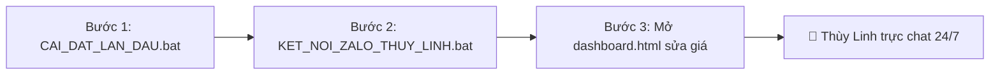

# 📖 CẨM NANG HƯỚNG DẪN SỬ DỤNG TRỢ LÝ AI EM THÙY LINH
### *Hệ Thống Tự Động Trực Chat, Tư Vấn & Chốt Đơn Đa Kênh 24/7 (Zalo, Fanpage & Website)*

> **Đơn vị phát triển:** HAITECH BOT STUDIO  
> **Hotline/Zalo hỗ trợ kỹ thuật 24/7:** 0988 739 896  
> **Email:** vanhaitech.86@gmail.com  
> **Hệ thống Webhook Cloud:** https://bot-zalo-ai.vercel.app  
> **Phiên bản:** v1.0 Thương Mại Chính Thức  

---

## 📑 MỤC LỤC
1. [Giới thiệu Trợ lý AI Em Thùy Linh](#1-giới-thiệu-trợ-lý-ai-em-thùy-linh)
2. [Hướng dẫn 3 bước khởi động nhanh cho Zalo cá nhân](#2-hướng-dẫn-3-bước-khởi-động-nhanh-cho-zalo-cá-nhân)
3. [Bộ phím tắt & Điều khiển từ xa qua điện thoại](#3-bộ-phím-tắt--điều-khiển-từ-xa-qua-điện-thoại)
4. [Hướng dẫn đấu nối Facebook Fanpage Messenger (Cloud 24/7)](#4-hướng-dẫn-đấu-nối-facebook-fanpage-messenger-cloud-247)
5. [Hướng dẫn đấu nối Website (Widget LiveChat AI 1 dòng mã)](#5-hướng-dẫn-đấu-nối-website-widget-livechat-ai-1-dòng-mã)
6. [Hướng dẫn nạp bảng giá & kịch bản chốt đơn cho Shop](#6-hướng-dẫn-nạp-bảng-giá--kịch-bản-chốt-đơn-cho-shop)
7. [Bảng xử lý sự cố thường gặp (FAQ & Troubleshooting)](#7-bảng-xử-lý-sự-cố-thường-gặp-faq--troubleshooting)
8. [Chính sách bảo hành & Hỗ trợ kỹ thuật](#8-chính-sách-bảo-hành--hỗ-trợ-kỹ-thuật)

---

## 1. GIỚI THIỆU TRỢ LÝ AI EM THÙY LINH

**Em Thùy Linh** là Trợ lý Trí tuệ Nhân tạo (AI) đa năng được thiết kế riêng cho các chủ shop kinh doanh, doanh nghiệp và người bán hàng online tại Việt Nam:

*   ⚡ **Phản hồi tức thì < 1 giây:** Giữ chân khách hàng ngay khi họ phát sinh nhu cầu, không để khách phải chờ đợi.
*   🧠 **Bộ Não Kép Đột Phá:**
    *   *Bộ Não 1 (Tri thức bảng giá):* Báo đúng giá, thông số, chính sách bảo hành theo cài đặt của shop.
    *   *Bộ Não 2 (Google Gemini AI):* Tự động tư vấn, khéo léo xin số điện thoại, xử lý tình huống khéo léo khi khách hỏi câu hỏi mở.
*   🛡️ **Bộ lọc an toàn 100%:** Chỉ trả lời tin nhắn 1-1 riêng tư của khách hàng, **tuyệt đối không nhắn vào nhóm chat/hội bạn bè**.
*   🌐 **Đồng bộ đa kênh:** Nạp thông tin 1 lần, Em Thùy Linh tư vấn đồng thời trên cả **Zalo cá nhân, Fanpage Messenger và Website**.

---

## 2. HƯỚNG DẪN 3 BƯỚC KHỞI ĐỘNG NHANH CHO ZALO CÁ NHÂN

Chỉ mất **chưa đầy 2 phút** để kích hoạt Em Thùy Linh trên Zalo:



### 👉 BƯỚC 1: Cài đặt lần đầu (Chỉ làm 1 lần duy nhất)
1. Giải nén thư mục phần mềm.
2. Nhấp đúp chuột vào file:
   👉 **`CAI_DAT_LAN_DAU.bat`**
3. Cửa sổ màu xanh sẽ tự động:
   *   Kiểm tra môi trường Node.js trên máy (nếu chưa có, trình duyệt sẽ tự mở trang tải về cài đặt miễn phí).
   *   Tự động tải và cài đặt toàn bộ thư viện AI kết nối Zalo.
4. Khi màn hình hiện `CHÚC MỪNG! CÀI ĐẶT THÀNH CÔNG 100%!`, bạn bấm phím bất kỳ để đóng.

---

### 👉 BƯỚC 2: Quét mã QR kết nối Zalo (10 giây)
1. Nhấp đúp chuột vào file:
   👉 **`KET_NOI_ZALO_THUY_LINH.bat`** *(hoặc `CHAY_BOT_ZALO.bat`)*
2. Sau 3 - 5 giây:
   *   Mã QR sẽ hiển thị trực tiếp trong cửa sổ màu đen.
   *   Đồng thời tự động bật trình duyệt web (`qr.html`) hiển thị mã QR to rõ ràng.
3. Mở ứng dụng **Zalo trên điện thoại**:
   *   Bấm vào biểu tượng **Quét mã QR** ở góc trên cùng bên phải.
   *   Hướng camera quét vào mã QR trên màn hình máy tính ➡️ Bấm **Đăng nhập** (hoặc *Xác nhận*).
4. Khi màn hình hiện:
   ```text
   🎉 HAITECH BOT - TRỢ LÝ THÙY LINH ĐÃ SẴN SÀNG HOẠT ĐỘNG 100%!
   🟢 TRẠNG THÁI HIỆN TẠI: ĐANG BẬT (Trực 24/7)
   ```
   ➡️ Em Thùy Linh đã chính thức trực chat trên Zalo của bạn!

> [!NOTE]
> Hệ thống sẽ tự lưu phiên đăng nhập vào file `session.json`. Từ lần sau, bạn chỉ cần bật bot là tự chạy luôn mà **không cần quét lại mã QR** nữa!

---

### 👉 BƯỚC 3: Nạp bảng giá & Tên shop của bạn
1. Nhấp đúp chuột mở file:
   👉 **`dashboard.html`** trên trình duyệt web.
2. Vào Tab **`📚 Nạp tài liệu & FAQ`**:
   *   Đổi tên Shop của bạn.
   *   Đổi số điện thoại Hotline.
   *   Thêm sản phẩm và giá bán mới.
3. Bấm **Lưu dữ liệu**. Thùy Linh sẽ tự động cập nhật ngay lập tức mà không cần khởi động lại!

---

## 3. BỘ PHÍM TẮT & ĐIỀU KHIỂN TỪ XA QUA ĐIỆN THOẠI

Hệ thống cung cấp sẵn các công cụ tiện lợi để bạn toàn quyền kiểm soát:

| File / Lệnh | Cách sử dụng | Tác dụng |
| :--- | :--- | :--- |
| **`BAT_THUY_LINH.bat`** | Nhấp đúp chuột trên máy tính | Bật Em Thùy Linh tự động tư vấn 24/7 |
| **`TAT_THUY_LINH.bat`** | Nhấp đúp chuột trên máy tính | Tạm dừng bot để bạn tự chat tay với khách |
| **`NGAT_KET_NOI_BOT.bat`** | Nhấp đúp chuột trên máy tính | Ngắt kết nối sạch sẽ, xóa phiên đăng nhập |
| **`TEST_BO_NAO_THU_2.bat`** | Nhấp đúp chuột trên máy tính | Thử trò chuyện kiểm tra AI Gemini độc lập |
| **Lệnh Zalo: `#tat`** | Nhắn từ Zalo điện thoại vào mục *Cloud của tôi* | Tạm tắt bot từ xa (không cần chạm máy tính) |
| **Lệnh Zalo: `#bat`** | Nhắn từ Zalo điện thoại vào mục *Cloud của tôi* | Bật lại bot từ xa ngay lập tức |
| **Lệnh Zalo: `#trangthai`** | Nhắn từ Zalo điện thoại vào mục *Cloud của tôi* | Kiểm tra bot đang BẬT hay TẮT |

---

## 4. HƯỚNG DẪN ĐẤU NỐI FACEBOOK FANPAGE MESSENGER (CLOUD 24/7)

Chức năng này giúp Em Thùy Linh tự động trả lời khách trên Facebook Fanpage mà **không cần mở máy tính**:

1. Mở file **`dashboard.html`** ➡️ Chọn Tab **`🌐 Kết nối Facebook Fanpage`**.
2. Truy cập [Meta for Developers](https://developers.facebook.com/) ➡️ Chọn ứng dụng của bạn ➡️ Vào sản phẩm **Messenger** ➡️ **Webhooks**:
   *   **Callback URL:** `https://bot-zalo-ai.vercel.app/api/facebook-webhook`
   *   **Verify Token:** `haitech_fanpage_bot_secret`
   *   Nhấn **Xác minh và lưu**.
   *   Tích chọn sự kiện: `messages` và `messaging_postbacks`.
3. Tạo **Mã truy cập trang (Page Access Token)** cho Fanpage của bạn ➡️ Dán vào ô tương ứng trên Dashboard ➡️ Nhấn **Lưu cấu hình Fanpage** ➡️ Nhấn **Kiểm tra kết nối**.

---

## 5. HƯỚNG DẪN ĐẤU NỐI WEBSITE (WIDGET LIVECHAT AI 1 DÒNG MÃ)

Chỉ cần nhúng **1 dòng mã duy nhất** vào website để có ngay nút bong bóng chat với Em Thùy Linh:

```html
<!-- TRỢ LÝ AI EM THÙY LINH CHO WEBSITE -->
<script src="https://bot-zalo-ai.vercel.app/haitech-chat-widget.js" 
  data-bot-name="Em Thùy Linh - Trợ lý HAITECH BOT" 
  data-phone="0988 739 896" 
  data-zalo-url="https://zalo.me/0988739896" 
  data-color="#0077B6" 
  data-position="right" 
  data-greeting="Dạ em chào anh/chị ạ! Em là Thùy Linh - Trợ lý AI của Shop. Em có thể hỗ trợ tư vấn sản phẩm hay gửi bảng giá ưu đãi hôm nay ạ? 😊" 
  async></script>
```

### Cách dán vào từng nền tảng:
*   **WordPress:** Vào `wp-admin` ➡️ Giao diện ➡️ Chỉnh sửa giao diện ➡️ mở file `footer.php` ➡️ dán trước thẻ đóng `</body>`.
*   **Haravan / Sapo / Shopify:** Vào Giao diện ➡️ Sửa code ➡️ mở file `theme.liquid` ➡️ dán trước thẻ `</body>`.
*   **LadiPage:** Thiết lập trang ➡️ Mã Javascript/CSS ➡️ Dán vào mục Body ➡️ Xuất bản lại.

---

## 6. HƯỚNG DẪN NẠP BẢNG GIÁ & KỊCH BẢN CHỐT ĐƠN CHO SHOP

Toàn bộ tri thức của Em Thùy Linh được lưu tại file:
👉 **`knowledge.json`**

Bạn có thể chỉnh sửa qua giao diện **`dashboard.html`** hoặc mở trực tiếp file `knowledge.json` bằng **Notepad**:

```json
{
  "botName": "Em Thùy Linh - Trợ lý Shop Gia Dụng ABC",
  "phone": "0988 739 896",
  "welcomeMessage": "Dạ em chào anh/chị ạ! Em là Thùy Linh. Em có thể tư vấn sản phẩm nào cho anh/chị hôm nay ạ? 😊",
  "rules": [
    {
      "keywords": ["giá", "báo giá", "chi phí", "bao nhiêu"],
      "reply": "Dạ bên em đang có ưu đãi giảm 20% hôm nay. Anh/chị cho em xin số điện thoại hoặc gọi hotline: 0988 739 896 để em gửi bảng giá chi tiết nhé ạ! 📋"
    },
    {
      "keywords": ["nồi chiên", "noi chien", "nồi hấp"],
      "reply": "Dạ nồi chiên không dầu cao cấp hiện có giá ưu đãi 1.250.000đ, bảo hành 12 tháng tận nơi ạ!"
    }
  ]
}
```

> [!TIP]
> **Cơ chế Hot-Reload:** Khi bạn lưu file `knowledge.json`, Bot đang chạy sẽ **tự động nạp dữ liệu mới ngay lập tức**, không cần khởi động lại bot!

---

## 7. BẢNG XỬ LÝ SỰ CỐ THƯỜNG GẶP (FAQ & TROUBLESHOOTING)

### ❓ Câu 1: Quét mã QR báo lỗi hoặc mã bị mờ/hết hạn?
👉 **Cách xử lý:** Mã QR có thời hạn trong 60 giây. Nếu hết hạn, hệ thống sẽ tự sinh mã mới. Bạn cũng có thể mở trực tiếp file ảnh `qr.png` trong thư mục hoặc mở trang `qr.html` trên trình duyệt để quét to rõ nét.

### ❓ Câu 2: Khách nhắn tin trong nhóm chat nhưng bot không trả lời?
👉 **Giải thích:** Đây là tính năng bảo vệ an toàn 100% của phần mềm. Bot được khóa chế độ bảo mật chỉ trả lời tin nhắn riêng tư 1-1 của khách hàng, tuyệt đối không nhắn vào nhóm bạn bè, gia đình hay hội nhóm công ty để tránh làm phiền.

### ❓ Câu 3: Làm sao để đổi sang số điện thoại Zalo khác?
👉 **Cách xử lý:** Nhấp đúp vào file `NGAT_KET_NOI_BOT.bat`. Sau đó nhấp đúp file `KET_NOI_ZALO_THUY_LINH.bat` và dùng số điện thoại Zalo mới quét mã QR.

### ❓ Câu 4: Khi tắt máy tính thì bot Zalo cá nhân có chạy không?
👉 **Giải thích:** Với Zalo cá nhân, bot chạy trên máy tính Windows của bạn nên cần mở máy (hoặc treo trên máy chủ ảo VPS). Còn với kênh **Facebook Fanpage** và **Website**, bot chạy trên nền tảng Cloud 24/7 nên tắt máy tính bot vẫn trả lời bình thường.

---

## 8. CHÍNH SÁCH BẢO HÀNH & HỖ TRỢ KỸ THUẬT

*   **Bảo hành & Cập nhật:** 12 tháng kể từ ngày kích hoạt phần mềm.
*   **Hỗ trợ kỹ thuật từ xa qua UltraViewer / Zalo Video Call:** 24/7.
*   **Đường dây nóng hỗ trợ:**
    *   📞 **Hotline/Zalo:** `0988 739 896`
    *   ✉️ **Email:** `vanhaitech.86@gmail.com`
    *   🌐 **Website:** [https://bot-zalo-ai.vercel.app](https://bot-zalo-ai.vercel.app)

*(Bản quyền phần mềm © 2026 HAITECH BOT STUDIO. Bảo lưu mọi quyền).*
